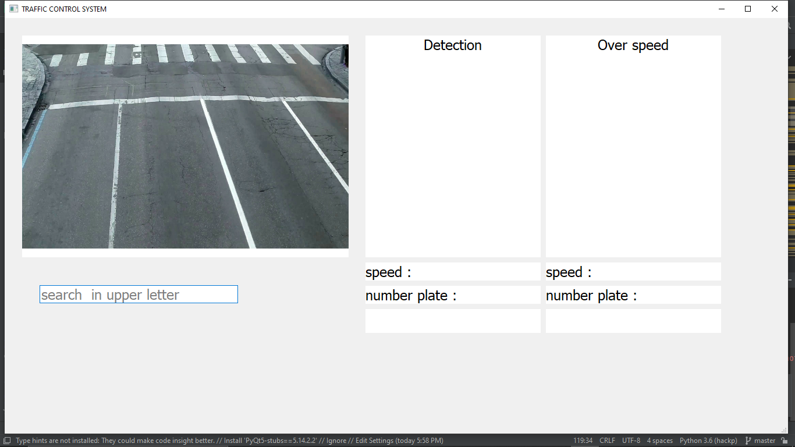
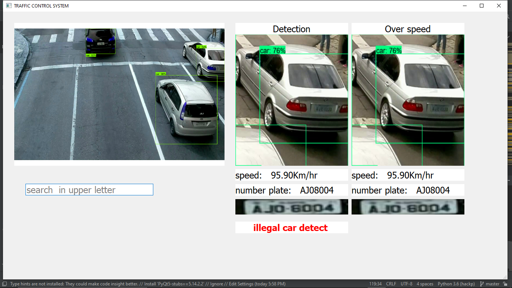
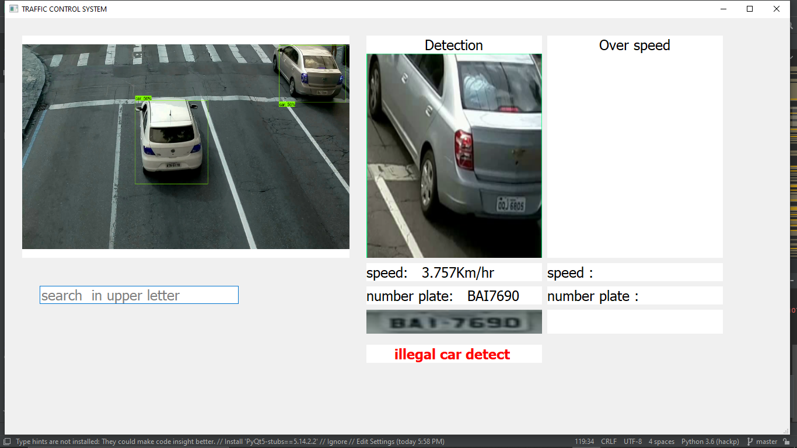

# phoenix-traffic-control-system-app

Traffic Rule Violation Detection System

                   This project tries to identify vehicles which break different traffic rules and laws. 
The aim of this project is to identify vehicles which carry fake number plates and  identifies vehicles which breaks traffic rules over speeding, rash driving etc. The vedio file the CCTV camera placed at different place are been used to identify the rule violation on the road. Vehicle images and number plates of every vehicle which passes a camera point are captured and save in  these images are compared with the data which are collected during the vehicle registration by this vehicle can be verified whether it carry fake number plate. Also by inputting the image or registration we can identify the camera point which the vehicles have crossed. We can also identify vehicles which breaks traffic rules such as over speeding, modification, rash drive etc

**Prerequisites**
Tensorflow 
openCV
SMPT
open ALPR api
object detection api 
numpy

 Built With
 
[Tensorflow](https://www.tensorflow.org/) - ML library

[Open ALPR](https://www.openalpr.com/) - For detecting license plate and extracting license plate number.
 
[SMPT] - Outgoing Email Server SMTP handles the sending of emails.

# RUN  phoenix-traffic-control-system-app

     # run ---> gui_impo.py
# output(app will start)

# out - 2 (lineEdit we can enter a license number, then App will detect registration number when it cross a camera point )

# out - 3 ( detect overspeed .app will save the car license plate number and send the detailed email )

# out -4 (app detect illigal number plate or color modifications)

